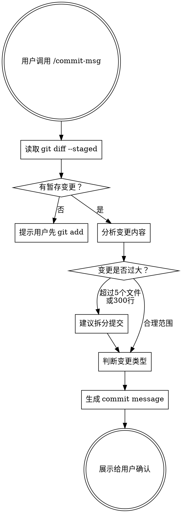

# Git Commit Message 规范化

## 概述

自动分析当前 git 暂存区的变更内容，生成符合 Conventional Commits 规范的 commit message。确保团队提交历史清晰、可追溯、可自动生成 changelog。

## 工作流程



## 执行步骤

### 第一步：读取暂存区变更

运行以下命令收集信息：

```bash
# 查看暂存的文件列表
git diff --staged --name-status

# 查看暂存的具体变更
git diff --staged

# 查看最近 5 条 commit（参考风格）
git log --oneline -5
```

如果暂存区为空，提示用户先执行 `git add`，**不要自动执行 git add**。

### 第二步：分析变更内容

分析以下维度：

| 维度 | 关注点 |
|------|--------|
| 变更范围 | 涉及哪些模块/目录 |
| 变更类型 | 新增功能、修复bug、重构、文档等 |
| 变更规模 | 文件数、行数是否合理 |
| 是否有破坏性变更 | API 变更、数据库迁移、配置格式变化 |

**过大提交的判断标准：**
- 超过 5 个不相关的文件被修改
- 变更超过 300 行（不含自动生成文件）
- 同时包含功能变更和重构

如果提交过大，给出拆分建议，列出建议的拆分方式。

### 第三步：判断变更类型

按照 Conventional Commits 规范，从以下类型中选择：

| 类型 | 含义 | 示例场景 |
|------|------|----------|
| `feat` | 新功能 | 添加用户注册接口 |
| `fix` | Bug 修复 | 修复登录页面崩溃 |
| `docs` | 文档变更 | 更新 README |
| `style` | 代码格式（不影响逻辑） | 调整缩进、去掉多余空行 |
| `refactor` | 重构（不改功能不修 bug） | 提取公共方法 |
| `perf` | 性能优化 | 添加数据库索引 |
| `test` | 测试相关 | 补充单元测试 |
| `build` | 构建系统或依赖 | 升级 webpack 版本 |
| `ci` | CI/CD 配置 | 修改 GitHub Actions |
| `chore` | 其他杂项 | 更新 .gitignore |

### 第四步：生成 Commit Message

**格式规范：**

```
<type>(<scope>): <subject>

<body>

<footer>
```

**各部分规则：**

**Header（必填）：**
- `type`：从上表选择，小写
- `scope`：可选，变更涉及的模块名（如 `auth`、`api`、`ui`）
- `subject`：简短描述，不超过 50 字符
  - 使用祈使语气（"add" 而非 "added"）
  - 首字母小写
  - 末尾不加句号
  - 中文项目可以用中文 subject

**Body（可选，推荐）：**
- 说明"为什么"做这个变更，而非"做了什么"
- 每行不超过 72 字符
- 与 header 空一行

**Footer（特殊情况）：**
- 破坏性变更：以 `BREAKING CHANGE:` 开头
- 关联 Issue：`Closes #123` 或 `Refs #456`

### 第五步：展示并确认

将生成的 commit message 展示给用户，格式如下：

```
📋 变更摘要：
- 修改了 3 个文件，新增 45 行，删除 12 行
- 主要变更：用户认证模块

📝 建议的 Commit Message：

feat(auth): add JWT token refresh mechanism

Implement automatic token refresh to prevent session expiration
during active use. Refresh triggers when token has less than
5 minutes remaining.

Closes #234

---
确认使用此消息提交？(Y/n)
```

**不要自动执行 git commit**，等待用户确认。

## 特殊情况处理

### 中英文混合项目

- 如果最近的 commit 是中文的，生成中文 message
- 如果最近的 commit 是英文的，生成英文 message
- 保持与项目已有风格一致

### 合并提交 (Merge Commit)

- 不处理 merge commit，提示用户使用默认的 merge message

### 空提交

- 如果暂存区没有变更，提示用户先 `git add`
- 列出当前未暂存的修改文件供参考

## 常见错误示例

```
# ❌ 类型不对
update: 修改了用户模块        # "update" 不是标准类型

# ❌ subject 太长
feat: 添加了用户注册功能包括邮箱验证手机验证以及第三方登录支持

# ❌ 描述"做了什么"而非"为什么"
fix: changed line 42 in auth.js

# ✅ 正确示例
feat(auth): add email verification for user registration

Enable email verification during signup to reduce fake accounts.
Users receive a 6-digit code valid for 15 minutes.

Closes #189
```
