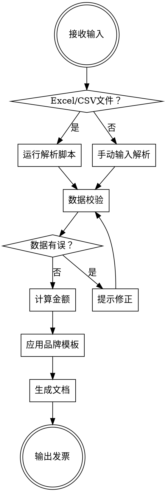

# 发票生成器

## 概述

解析 Excel/CSV 时间表数据或手动输入的账单信息，按照公司品牌模板生成专业的发票文档（Word/PDF 格式）。支持自动计算金额、税费，并确保格式统一。

## 使用场景

- 自由职业者按时间表生成月度发票
- 小团队给客户开具项目账单
- 从已有的 Excel 工时表快速生成发票

## 工作流程



## 执行步骤

### 第一步：获取输入数据

**方式一：解析 Excel/CSV 文件**

如果用户提供了文件，使用 `scripts/parse_timesheet.py` 脚本解析：

```bash
python scripts/parse_timesheet.py <文件路径>
```

脚本会输出结构化的 JSON 数据。

**方式二：手动输入**

引导用户提供以下信息：

```
📋 请提供以下发票信息：

【发票方信息】
- 公司/个人名称：
- 地址：
- 联系方式（邮箱/电话）：
- 银行账户信息（可选）：

【客户信息】
- 客户名称：
- 客户地址：
- 联系人（可选）：

【账单明细】（可多条）
- 服务描述：
- 数量/小时数：
- 单价：

【其他】
- 货币单位（默认 CNY）：
- 税率（默认 0%）：
- 付款期限（默认 30 天）：
- 备注（可选）：
```

### 第二步：数据校验

验证以下内容：

| 检查项 | 规则 |
|--------|------|
| 必填字段 | 发票方名称、客户名称、至少一条明细 |
| 数值合法性 | 数量 > 0，单价 ≥ 0，税率 0-100% |
| 日期格式 | YYYY-MM-DD 格式 |
| 货币一致性 | 所有金额使用同一货币单位 |

如果有问题，列出所有错误，一次性让用户修正。

### 第三步：金额计算

```
每条明细小计 = 数量 × 单价
税前总额 = 所有明细小计之和
税额 = 税前总额 × 税率
应付总额 = 税前总额 + 税额
```

**精度要求：** 所有金额保留 2 位小数，使用银行家舍入法（四舍六入五成双）。

### 第四步：生成发票文档

使用 `python-docx` 生成 Word 文档，需要写一个 Python 脚本来实现。

**发票模板结构：**

```
┌─────────────────────────────────────────┐
│  [LOGO]        发票 / INVOICE           │
│                                         │
│  发票编号：INV-2025-001                  │
│  开票日期：2025-03-25                    │
│  付款期限：2025-04-24                    │
├─────────────────────────────────────────┤
│  发票方：                客户：          │
│  公司名称               客户名称        │
│  地址                   地址            │
│  联系方式               联系人          │
├─────────────────────────────────────────┤
│  序号 │ 描述 │ 数量 │ 单价 │ 小计       │
│  1    │ ...  │ ... │ ... │ ...         │
│  2    │ ...  │ ... │ ... │ ...         │
├─────────────────────────────────────────┤
│                    税前总额：¥ X,XXX.XX │
│                    税额 (X%)：¥ XXX.XX  │
│                    ━━━━━━━━━━━━━━━━━━━ │
│                    应付总额：¥ X,XXX.XX │
├─────────────────────────────────────────┤
│  付款方式：银行转账                      │
│  账户名称：XXX                          │
│  银行名称：XXX                          │
│  账号：XXXX XXXX XXXX XXXX             │
├─────────────────────────────────────────┤
│  备注：                                 │
│  感谢您的合作！                          │
└─────────────────────────────────────────┘
```

**品牌规范：**

| 元素 | 规范 |
|------|------|
| 主色调 | 由用户在首次使用时指定，默认 #2563EB（蓝色） |
| 字体 | 中文用微软雅黑，英文用 Arial |
| 标题字号 | 24pt 粗体 |
| 正文字号 | 11pt |
| 表头 | 主色调背景 + 白色文字 |
| 金额 | 右对齐，千分位分隔符 |
| Logo | 如果 assets/ 目录下有 logo 文件则使用 |

### 第五步：输出与确认

生成完成后，展示摘要：

```
✅ 发票已生成！

📄 文件：invoice-INV-2025-001.docx
📊 摘要：
   - 客户：ABC 科技有限公司
   - 明细项：3 条
   - 税前总额：¥ 15,000.00
   - 税额（6%）：¥ 900.00
   - 应付总额：¥ 15,900.00
   - 付款期限：2025-04-24
```

## 发票编号规则

格式：`INV-{年份}-{序号}`

- 序号从 001 开始，三位数补零
- 同一年度内递增
- 如果当前目录下已有发票文件，自动读取最大序号 +1

## 常见问题

### 多币种怎么处理？
每张发票只支持一种货币。如果有多币种需求，生成多张发票。

### 如何自定义品牌色？
首次使用时告诉 Claude 你的品牌色（如"我们的品牌色是 #FF6B35"），后续会记住。也可以在 `references/brand-config.json` 中配置。

### Excel 格式要求？
脚本支持以下列名（不区分大小写）：
- Date / 日期
- Description / 描述 / 项目
- Hours / Quantity / 数量 / 小时
- Rate / Price / 单价
- Amount / 金额（可选，会自动计算）
